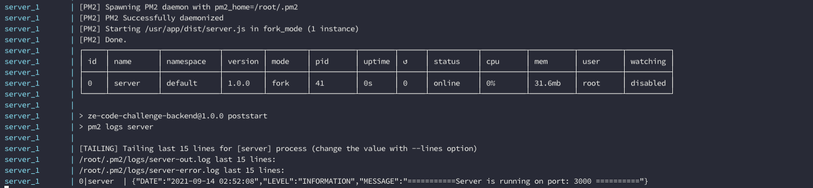
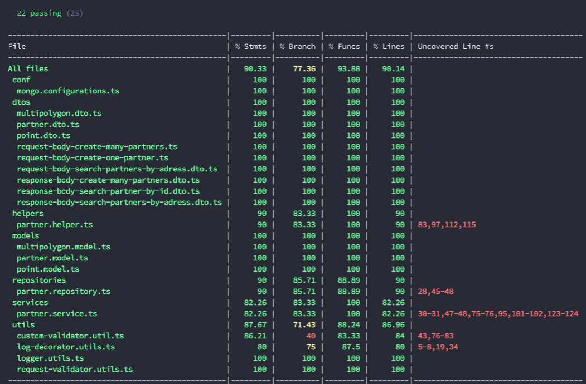
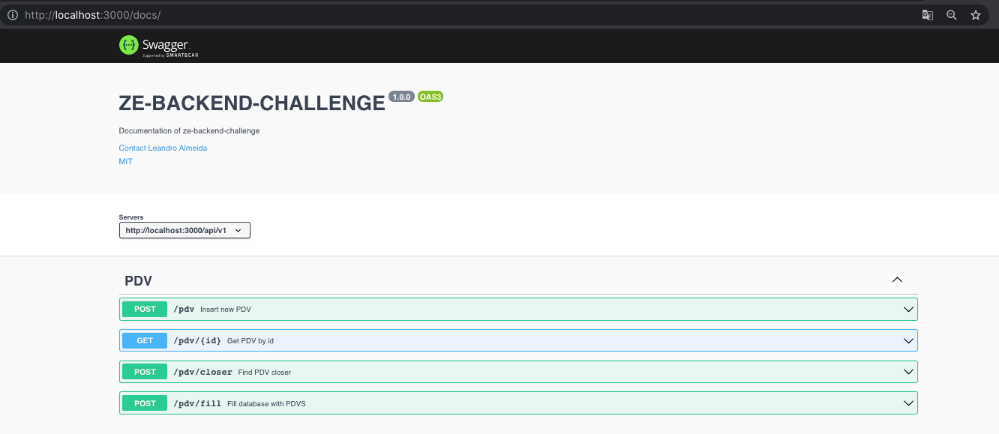

# CODE CHALLENGE - ZÉ - BACKEND
### 📖  DESCRIÇÃO:

Este é um repositório referente ao desafio de implementação destinado aos candidatos a vaga de Backend-Enginner.

### 📝 TECNOLOGIAS QUE UTILIZEI:

- **TYPESCRIPT/WEBPACK**: 
    - Utilizei para gerar o código fonte da resolução do desafio.

- **DOCKER/DOCKER-COMPOSE**:
    - Utilizei para padronizar os ambientes de execução da aplicação.
- **MONGODB**
    - Utilizei para armazenar as informações de todos os parceiros.
- **REDIS**
    - Utilizei para armazenar os resultados das consultas em memória. Otimizando o retorno de requisões.
- **MOCHA/CHAI/NYC**
    - Utilizei para gerar, testar e analizar o resultados testes e cobertura.
- **PM2**
    - Utilizei para gerenciar a execução processo do servidor no docker.         
- **SWAGGER**:
    - Utilizei para documentar os endpoints da api.
### 📋 PRÉ-REQUISITOS:

1. Instalar o docker correspondente ao seu ambiente. Você pode consultar o guia de instalação através do [link](https://docs.docker.com/desktop/).

2. Instalar o docker-compose correspondente ao seu ambiente. Você pode consultar o guia de instalação através do [link](https://docs.docker.com/compose/install/).

3. Baixar ou clonar o repositório para sua máquina.


### 🔨 Build:

***Vá para o terminal, acesse a raiz do projeto (baixado/clonado)**

Para fazer o build da aplicação:
```
docker-compose build server
```
Para fazer o build dos testes:
```
docker-compose build test
```
### 🏃 Executar Aplicação:

***Vá para o terminal, acesse a raiz do projeto (baixado/clonado)**

Para iniciar a aplicação execute este comando:
```
docker-compose up -d server
```
Para iniciar a aplicação e acompanhar os logs, execute este comando:
```
docker-compose up server
```
Ao executar o comando anterior o resultado esperado é esse:



***Obs: Ao iniciar a aplicação eu preencho a base com os dados de exemplo disponíveis [aqui](https://github.com/ZXVentures/ze-code-challenges/blob/master/files/pdvs.json).**
### 💨 Executar Testes:

***Vá para o terminal, acesse a raiz do projeto (baixado/clonado)**

Para executar Testes:
```
docker-compose up test
```
Ao executar o comando anterior o resultado esperado é esse:



### ▶️ Utilizar:

- Você pode acessar a api de documentação do swagger atravez do link : http://localhost:3000/docs/ e utilizar os serviços por lá.
    - Tela do Swegger:



- Você também pode utilizar a api através de alguma outra api client como: [POSTMAN](https://www.postman.com/) ou [INSOMINIA](https://insomnia.rest/).

## 🤝 Desenvolvedores:

👤 **Leandro Almeida**